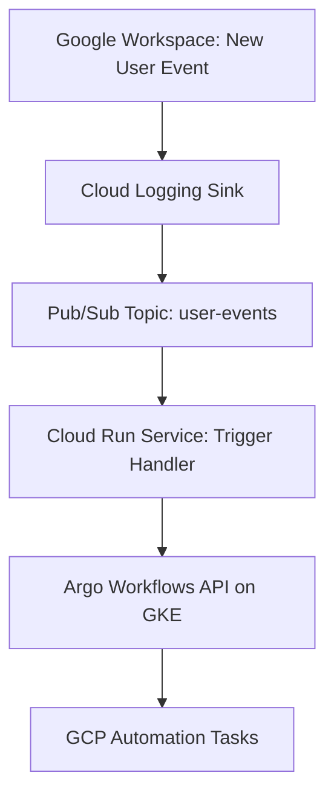

# 🚀 GCP Workspace User Onboarding Pipeline using Argo Workflows


---

## 📘 Overview

This project automates user onboarding workflows in GCP based on Google Workspace events. When a new user is added to Google Workspace, an audit log event is captured and streamed through GCP’s Pub/Sub, triggering a Cloud Run service that launches an Argo Workflow on GKE to perform predefined GCP automation tasks.

## 🛠 Architecture



## 🔧 Components

* **Google Logging Sink** to export workspace user creation events.
* **Pub/Sub Topic** that collects filtered logs and triggers workflows.
* **Cloud Run** HTTP-triggered service to parse and push workflow jobs.
* **GKE Cluster** hosting Argo Workflows.
* **Helm** deployed Argo Workflows using Terraform.

---

## 📦 Modules Structure

```
.
├── main.tf
├── variables.tf
├── outputs.tf
├── README.md
```

## 📋 Prerequisites

* Google Cloud CLI authenticated
* Enabled APIs:

  * Kubernetes Engine API
  * Cloud Logging
  * Cloud Run
  * IAM Service Account Credentials
  * Pub/Sub

* Service account with Editor/Owner role or fine-grained roles for:

  * GKE Admin
  * Cloud Run Admin
  * Pub/Sub Admin

## 🔐 Secure by Design

* Logs filtered to specific method names (`google.admin.directory.user.create`)
* Pub/Sub IAM binding to prevent unauthorized publishing
* OIDC tokens for Cloud Run -> Pub/Sub push

---

## 🚀 How to Deploy

```bash
# 1. Set required variables
export TF_VAR_project_id="your-gcp-project-id"
export TF_VAR_region="region"
export TF_VAR_network="default"
export TF_VAR_subnetwork="default"
export TF_VAR_trigger_handler_image="gcr.io/your-project/trigger-handler:latest"
export TF_VAR_argo_workflows_api="https://argo-gateway-endpoint"
export TF_VAR_cloud_run_service_account="service-account@project.iam.gserviceaccount.com"

# 2. Init and apply
terraform init
terraform apply -auto-approve
```

---

## 🧪 Testing the Workflow

1. Add a user to your Google Workspace manually or via script.
2. The logging sink will push the event to Pub/Sub.
3. The Cloud Run service receives the push and triggers an Argo Workflow via API.
4. Argo executes the required automation pipeline.

---

## 📎 Useful Links

* [Argo Workflows Docs](https://argoproj.github.io/argo-workflows/)
* [Terraform Google Provider](https://registry.terraform.io/providers/hashicorp/google/latest/docs)
* [GKE Setup Docs](https://cloud.google.com/kubernetes-engine/docs)

---
